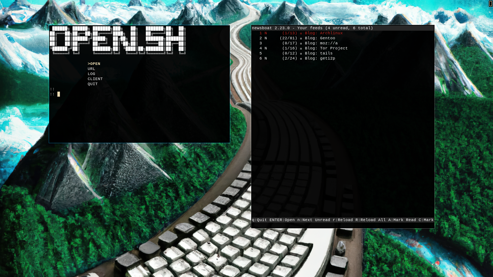

__OPEN.SH__
===========

__AUTOMATIC URL TYPING IS BROKEN_A__

__An add-on script for newsboat, with cross computer URL sharing.
That proxy's through Tor.__

INSTALLATION
------------

To install to user bin file.
        
        sudo make install

_Need root privileges for moving the executable to /usr/bin/ directory._

Needed Dependencys
------------------

- [gcc](https://gcc.gnu.org/) _for compilation_
- [xdotool](https://github.com/jordansissel/xdotool) _for browsers_

Optional Dependences
--------------------

_most of the above I want to be down here_

- [nvim](https://neovim.io/) _for log function_
- [Proxychains](https://github.com/haad/proxychains) or
- [Proxychains-ng](https://github.com/rofl0r/proxychains-ng)
- [mpv](https://mpv.io/)

Todo
====

- add support
    * Wayland
    * Multiple ip and ip selection
    * some encryption for transmission of urls
    * support for IPv6
    * Automatic loging in?
    * Support for media, Cage WM?
    * add copy to clip board as alternative to opening browser or video
    * ~~other browser like firefox, librewolf, brave, lynx, links, etc... Including detecting witch is installed~~
    * ~~"log" text editors, vim, vi, ed, ETC~~
    * ~~media viewer mpv, vlc, (idk), etc...~~ : open.c
    * ~~Add availability for both gnu and openbsd netcat~~ : removing the middle man
- find a way to use other terminals kitty, alacritty, ETC : scroll stops working
- server in c
- Multipal newsboat urls
- proxychains better support and easy off switch in c
- option to start and login through ftp
- summary of updates, would then give you a summary then two options, update or do not update
- version auto update notify.
- shrink photo for faster loading of readme
- add clock to client and server
- __~~phase out open.sh~~__
- __~~add makefile~~__
- __~~add readme how to use program~~__
- __~~proxychains better support and easy off switch~~__
- __~~transmit server.sh to a /tmp folder~~__
- __~~client in c~~__
- __~~add a main window, for better control~~__
- __~~add a config.h~~__

# __For developers__

For help in use of development.
This command to test out the menu and other tui type things.
        
        make test

I use this command to test the URL opening function from
out side the TUI. URL configurable in makefile, 
_if you can find a better URL, give me your reasoning's, and ill consider changing it_

        make test2

# Contribution Guidelines

* Search previous suggestions and issues before making a new one, as yours could be a duplicate.
* Make an individual pull request for each suggestion.
* New code, or code improvements to the existing code is welcome.
* Try to check your spelling and grammar, and don't hesitate to fix mine.
